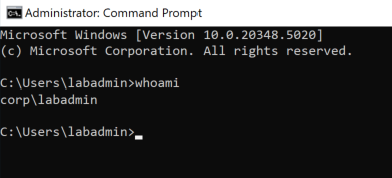

# Cloud Identity & Security Monitoring Lab: Microsoft Azure & Active Directory

## 🎯 Project Objective
This lab demonstrates the deployment, configuration, and monitoring of a cloud-based **Hybrid Identity Environment**. By utilizing **Microsoft Azure**, **Windows Server**, and **Active Directory Domain Services (AD DS)**, I established a secure corporate network architecture. The primary focus was on user lifecycle management, Role-Based Access Control (RBAC), and analyzing security telemetry via the Windows Event Viewer to simulate a SOC Analyst's investigation workflow.

---

## 🏗️ Cloud Infrastructure (Microsoft Azure)

### Resource Management & FinOps
All resources were organized within a centralized Resource Group to ensure administrative efficiency. I implemented **Cloud Governance** by configuring an **Auto-shutdown policy** (11:00 PM EST) for all virtual assets to optimize costs and follow sustainability best practices.

### Network Security & Topology
The environment consists of two virtual machines: a Domain Controller (DC01) and a Client Workstation (Client01). Traffic is filtered through **Network Security Groups (NSGs)** to maintain a hardened perimeter, allowing only necessary traffic for management and domain operations.

---

## 🛠️ Active Directory Configuration

### Domain Services Deployment
I provisioned a Windows Server instance as the **Domain Controller** for the `corp.local` forest. This involved the installation of AD DS and the configuration of internal DNS to handle domain-wide name resolution.

### User Management & RBAC
I created an **Organizational Unit (OU)** structure to logically segment users. To simulate real-world identity management, I provisioned several test accounts and implemented **Role-Based Access Control (RBAC)** by managing permissions through Security Groups.

* **Users:** Alice, Bob, and Charlie.
* **Provisioning:** Accounts created with standard corporate password policies.
* **Access Control:** Manually configured the "Remote Desktop Users" group to allow the `alice` account remote access to the workstation.

---

## 🧪 Testing & Verification

### Domain Integration
The Client VM was successfully joined to the `corp.local` domain. Connection was verified using `ping` and `nslookup` to ensure proper communication between the workstation and the DC.

### Authentication & Access
Verified the "Alice" account's ability to log in to the domain environment and access shared network resources. I utilized the `whoami` command to confirm that the identity session was correctly established as `corp\alice`.

---

## 🛡️ Security Monitoring (SOC Perspective)

A key objective of this lab was identifying and correlating security events within the **Windows Event Viewer**. This simulates the telemetry analysis performed by SOC analysts during incident response.

### Event Correlation Table
| Action Performed | Event ID | SOC Relevance |
| :--- | :--- | :--- |
| **New Account Creation** | 4720 | Tracking user provisioning for auditing. |
| **Successful Logon** | 4624 | Baseline for normal user activity. |
| **Password Reset (Admin)** | 4724 | Detecting potential unauthorized credential changes. |
| **Privilege Assignment** | 4672 | Monitoring for administrative "SuperUser" logins. |

---

## 🚀 Skills & Tools Demonstrated
* **Cloud Platform:** Microsoft Azure (VNets, NSGs, Resource Groups, FinOps Governance).
* **Identity Management:** Active Directory Domain Services (AD DS), OU Design, User Lifecycle Management.
* **Networking:** DNS Configuration, DHCP, CIDR Subnetting, Troubleshooting (Ping, Nslookup).
* **Security & Compliance:** Role-Based Access Control (RBAC), Least Privilege Principle, NIST CSF/CIS Control Mapping.
* **Telemetry:** Windows Event Log analysis and security event correlation.
